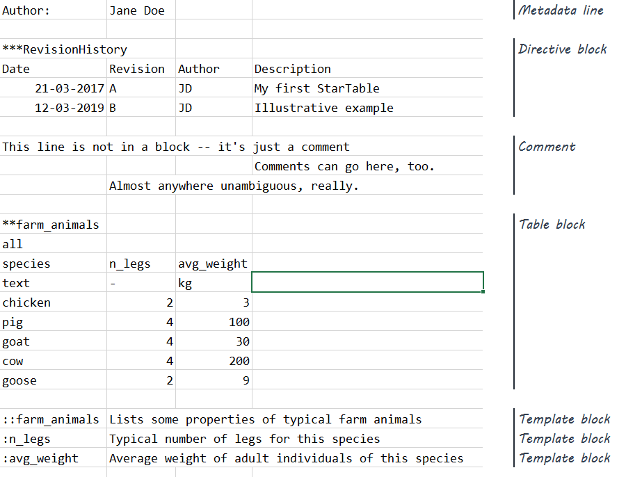

# The StarTable data format

StarTable is a data format designed to conveniently store an arbitrary number of two-dimensional tables of data in a way that is 

* human- and machine-readable; and
* easy to edit, audit, and version. 

In addition to tabular data, StarTable also supports 

* metadata at the file, table, and columns levels; 
* templating and comments; and
* application-specific functionality such as relations between tables and include statements. 

The StarTable format is file-format agnostic. In practice, CSV files and Excel workbooks are most commonly used to store StarTable-formatted data. But any file format that can be used to represent a set of tables, each with columns and rows of cells, can, in principle, adhere to the StarTable format.

## What problem StarTable solves

StarTable is geared towards easing human quality assurance while remaining machine-readable and versionable. Thus it differentiates itself from other data formats:

- Supports "generalist" file formats such as Excel and CSV, which: 
  - Are easy to open/edit/QA with general-purpose software available on most machines (i.e. including non-technical stakeholders); and
  - Can be versioned with enterprise document management systems and/or text-based version control systems.
- One file or many files – up to you
  - One file *can* contain all the tables required for a given project. 
  - Though you can also *choose* to split one StarTable file into multiple files according to some convenient logic; for example, different files having different owners responsible for their content, under different versioning.

Alternate data formats such as SQLite, other databases, and zip archives of text files, do not naturally fulfill these needs. 

## Parsers and utilities

StarTable parsers exist for [Python](https://github.com/startable/startables-python), MATLAB, and C#. They can currently parse StarTable files in CSV and Excel format. 

The StarTable Editor is an Excel add-in that helps humans read, write, quality-control, and prettify StarTable files. 

These have all been developed in private repos, but in March 2019, it was decided to open-source them, and they will be placed on [GitHub](https://github.com/startable) in due course.  

## Quick overview of the StarTable format

Let's have a high-level, example-based look at the StarTable format. Further details are available in the full [StarTable format specification](https://github.com/startable/startable-standard/blob/master/StarTable%20format%20specification.md).

Below is an example StarTable file as viewed in Microsoft Excel. In it you'll see the various block types that StarTable supports, as annotated on the right. 

Blocks are separated by one or more blank lines (except template lines, which may be contiguous; and metadata lines, which must be contiguous at the top of the file). 

The type of any given block can be unambiguously determined by the contents of its first cell in the leftmost column. 

### Table blocks

*Table blocks* are the meat and potatoes of StarTable. Table blocks are (typically) where you would put most of your data. In some bare-bones cases, this may be the only type of block you'll need in a StarTable file. 

The example file above contains only one table block, but StarTable files can contain an arbitrary number of table blocks – and of any other block type, for that matter. 

Let's take a closer look at the example table block:

Table blocks start with a cell containing a `**` prefix followed by the *table name*, in this case, `farm_animals`. The table name is usually descriptive of the what the table contains. 

The cell below that is the *destinations* field. It's a list of space-delimited strings that can be used in an application-specific way, typically to establish:

- relationships between various table blocks; or
- namespaces.

The default destination is `all`, meaning no specific relationship is established, i.e. this table applies to the entire context. 

Below the destination are an arbitrary number of columns. Each column starts with a *column name* in its top cell, followed by the *column unit* in the cell below that. Then follows an arbitrary number of rows containing values. All columns in a table block must have the same number of rows. 

### Super quick intro to all the other block types

*Metadata lines*' first cell ends with a `:`. They indicate something about the StarTable file itself. In the example above, the file's author is indicated in a metadata line. 

*Directive blocks* start with `***` followed by the *directive name*. The contents of directive blocks are to be passed as a cell array to the client application. One use case is "include" statements, indicating to the application that additional StarTable files are to be read. 

*Template lines* tell us something about the expected contents of tables; either a table as a whole, or a column in that table. They are used for matching against templates, and to guide the human user. Template blocks start with one or more `:` depending on their level (two for table, one for column). 

*Comments* are free-text remarks, analogous to comments in source code. You can write comments pretty much anywhere (between blocks and to the right of blocks), as long as they don't cause ambiguity with other blocks and block types. 

### Overview of the structure of a StarTable file

Here is an illustration of the hierarchical structure of a StarTable file:

A StarTable file can be saved as a CSV file, or as an Excel workbook, or as any other file format that can represent columns and rows. Some of these file formats, such as Excel workbooks, can support multiple *sheets*. Others, such as CSV files, can typically contain only one sheet. 

Therefore, a more complete characterization of the example StarTable file shown further above is that it contains only one *sheet*, which in turn only contains one table block (along with a few other blocks of other types). 

