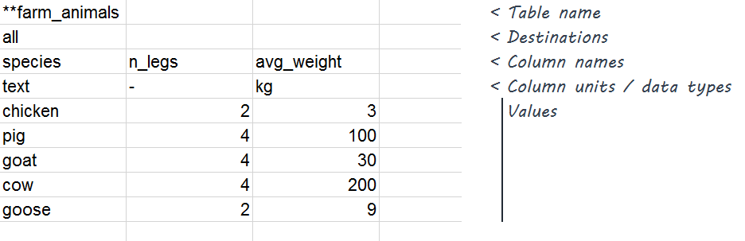
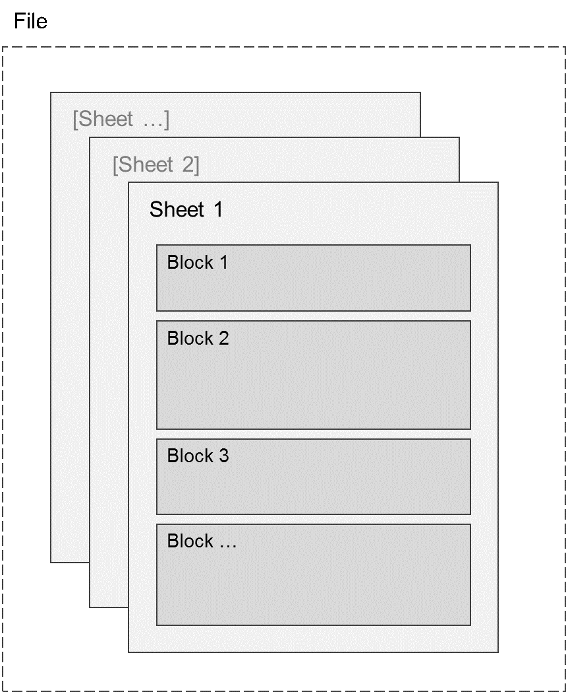

# The StarTable format specification

## What is StarTable?

StarTable is a human- and machine-readable format designed to conveniently
store arbitrary numbers of two-dimensional tables of data. It also supports peripheral information elements such as metadata and application-specific functionality. 

The StarTable format is file-format agnostic. Any file format that can be used to represent a set of
tables, each with columns and rows of cells, can in principle adhere to the StarTable format, though in practice, CSV and Excel workbooks are most commonly used.

### History

The StarTable format traces its origins to a single software project in the Foundations department of Offshore Wind at [Ørsted](https://orsted.com/) in the mid 2010's, in which it was, and still is, used by engineers for the entry, input/output, quality assurance, and version control of technical data related to structural calculations for wind turbine foundations. 

By 2018, the format's use had spread to five independent projects within the company due to its recognized convenience and flexibility. A common governance structure was established in December 2018 to ensure that continued development of the StarTable format would remain unified while meeting the needs of its diverse client projects within Ørsted. 

In February 2019, approval was granted to open source not only the StarTable standard itself, but also the suite of software packages and utilities that allow reading/writing/manipulating/displaying StarTable files in various programming languages and technologies. Governance remains Ørsted-based for the time being, though this is liable to change if, as hoped for, a community of users emerges outside Ørsted. 

## Quick overview of the StarTable format

Before diving into the formal, detailed specification of the StarTable format, let's have a high-level, example-based look at it. 

Here is an example StarTable file as viewed in Microsoft Excel. In it you'll see the various block types that StarTable supports, as annotated on the right. The blocks are separated by one or more blank lines. 


### Intro to table blocks

*Table blocks* are the meat and potatoes of StarTable, which is why we'll spend a few lines discussing them here. Table blocks are (typically) where you would put most of your data. In some bare-bone cases, this may be the only type of block you'll really want or need in a StarTable file. 

The example file above contains only one table block, but StarTable files can contain any number of table blocks – and of any other block type, for that matter. Nevertheless, let's take a closer look at the example table block:



The first cell of a table block contains the *table name*, in this case, `farm_animals`, preceded by a `**` prefix, which indicates the start of the table block. The table name is usually descriptive of the contents of the table. 

The cell below that is the *destination*; we won't dig into what this is right now, but long story short, it's a fairly free-form list of space-delimited strings that can be used in an application-specific way, typically to establish relationships between various table blocks. The default destination is `all`, meaning no specific relationship is established, i.e. this table applies to the entire context. 

Below the destination are an arbitrary number of columns. Each column starts with a *column name* in its top cell, followed by the *column unit* in the cell below that. Then follows an arbitrary number of rows containing values. All columns in a table block must have the same number of rows. 

### Super quick intro to all the other block types

*Metadata lines* indicate something about the StarTable file itself. In the example above, the file's author is indicated in a metadata line. Their first cell always ends with a `:`.

*Directive blocks* start with `***` followed by the *directive name*. They are fairly free-form and their design and usage is application-specific. 

*Template blocks* tell us something about the contents of the file; either about the file as a whole, the table immediately preceding the template block, or a column in that table. Template blocks start with one or more `:` depending on their level (three for file, two for table, one for column). 

*Comments* are free-text remarks, analogous to comments in source code. You can write comments pretty much anywhere (between blocks and to the right of blocks), as long as they don't cause ambiguity with other blocks and block types. 

### Overview of the structure of a StarTable file

Here is an illustration of the hierarchical structure of a StarTable file:



The StarTable format is file-format-agnostic. A StarTable file can be saved as a CSV file, or as an Excel workbook, or as any other file format that can represent columns and rows. Some of these file formats, such as Excel workbooks, can support multiple *sheets*. Others, such as CSV files, can't; they can contain only one sheet. 

Therefore, a more complete characterization of the example StarTable file shown further above is that it contains only one *sheet*, which in turn only contains one table block (along with a few other blocks of other types). 

This concludes this quick intro to StarTable. What follows is a more formal, detailed, and rigorous description of the StarTable format. 

## Level 0 - Low level file structure

Level 0 parser is file-format specific. Splits file in blocks. 

### File format

The StarTable format is file-format agnostic. To be StarTable-ready, a given file format must be able to represent a
two-dimensional array of cells, with the array being of arbitrary length
and width, and with each cell containing a value of one of the atomic
types described further below (basically: strings, numbers, datetimes, and valid empty-cell markers). 

Examples of StarTable-ready file formats are CSV (Comma-Separated Values), which can contain only one sheet, and Excel workbooks, which can
contain multiple sheets. At the time of writing this document, these are
the only two StarTable file formats used in practice. This
should not, however, be understood as a formal limitation. In principle,
nigh any file format could be used for StarTable files – though not
all to the same degree of convenience. Further conceivable examples of
a file format that can contain multiple sheets are:

- JSON
- A compressed zip archive of multiple CSV files.

In file formats where files can contain multiple sheets, each sheet must
be named such as to be uniquely identifiable, and the level 0 processing 
should only include sheets with names matching the ''INPUT_SHEET_NAME_RE'' regexp. ?????<<< possible feature: an application-specific regex

### Atomic types and values

Cells each contain a value of one of the following atomic types:

-   String
-   Numeric types:
    -   Floating-point number
    -   Integer
    -   DateTime

Empty cells are to be treated as containing an empty string. 

Numeric type cells may not be left empty. Null or missing values may 
be represented by either of the following valid null markers: `-`, `nan`, `NaN`, or `NAN`.

#### Restrictions on strings

Strings may not contain characters used to represent the end of a line
(such as end of line and line feed) as this would introduce ambiguity
between cell content and the end of a row. Note that this remark applies
throughout this document: there are a few instances where we indicate
that a given field can consist of “any string”; this should be
understood as shorthand for, any string not including these aforementioned forbidden characters.

#### Additional restrictions on symbol strings

*Symbols*, such as table names, column names, and destinations, are represented as
strings. In addition to general restrictions on strings as described above, these *symbol strings* are subject to the following restrictions:

-   They may only contain alphanumeric characters and `_` (underscore); and

-   The first character may not be a digit. 


## Hierarchical structure

The highest-level structure of the StarTable format proper is the
*sheet*. A sheet contains a series of *blocks* of different types. Blocks of type table are the main data
container, while other block types provide supplementary information and
functionality. 

Blocks consist of two-dimensional arrays of cells each containing an
*atomic value*. The detailed content of blocks depends on the block
type.

Sheets are contained in a file. Some file formats (such as CSV) can contain only one sheet, while others (e.g. Excel workbook) can contain multiple sheets. Since the StarTable format is file-format
agnostic, files are not part of the StarTable format proper, and a
detailed discussion of file formats is beyond the scope of this document. 

## Sheets

A StarTable sheet consists of an arbitrary number of rows, each
containing an arbitrary number of cells.

## Level 1 - Logical file structure: Series of blocks

The rows of a StarTable sheet are arranged as a series of “blocks”. Thus Level 1 processing maps a list of sheets to a single list of blocks of the types detailed below.

Any given row on a sheet can only be a member of one block, but all rows need not be in a block. 
(Rows that are not in a block are treated as “comments”.)

The block syntax is designed such that only the first column need be
considered in order to unambiguously split a sheet i.e. allocate its rows into blocks. Block
start markers are defined by the contents of cells in this first column.
The same is true of end markers – except in the case of metadata lines,
which are single-row blocks and require no end marker other than their
end of line. 

Blocks start when their start marker is encountered, and end when their
end marker is encountered. Blocks always include their start marker
cell, but exclude their end marker.

The primary content is placed in “table” blocks, but there are
additional block types that provide supplementary information and
functionality. The different block types are summarized in this table:

| Block type    | Start marker first-column cell content                       | End marker                                             | Description & remarks                                        |
| ------------- | ------------------------------------------------------------ | ------------------------------------------------------ | ------------------------------------------------------------ |
| Directive     | String starting with `***`                                   | - Empty first column cell; or<br>- New block start     | Placeholder for a variety of functions e.g.  <br> - Version control <br> - Allowing tables from various sources to be added dynamically to the set of tables statically present in a sheet |
| Table         | String starting with `**`                                                 (but not `***`) | - Empty first column cell; or <br> - New block start   | Primary data content                                         |
| Template      | String starting with `:` (one colon, possibly followed by more colons) | -   Empty first column cell; or <br> - New block start | Template data embedded in template files allow input files to be matched against a template, and provide a description of input data. |
| Metadata line | Any string that: <br />- Ends with `:`, and <br />- Is not a valid start marker for one of the other block types | End of line                                            | Are only accepted at the top of a sheet, before any other block types.<br />Provide information about the current sheet.<br />Always span exactly one line. |

The following sections describe the structure of these block types.

## Level 2 - Block structure

### Table block

A table block consists of:

-   The start marker prefix, `**`, followed by a *table name*;

-   *Destination list*, indicating what content this table applies to;
    and

-   An arbitrary number of vertical *table columns*, arranged
    side-by-side horizontally. Each column consists of:

    -   A *column name*, describing the contents of the column;

    -   A data type / unit indicator, hereafter simply referred to in shorthand as *unit*, used to distinguished between
        text content, unitless numerical content, and numerical content
        with units; and

    -   An arbitrary number of values. All columns within a given
        table must have the same number of rows i.e. values. 

These elements are illustrated in Figure 1 and described further below.


Generic example of a table block:

| `table name`   |                  |                  |       |
| ------------------ | ---------------- | ---------------- | ----- |
| **`destinations`** |                  |                  |       |
| **`col 1 name`**   | **`col 2 name`** | **`col 3 name`** | **…** |
| **`col 1 unit`**   | **`col 2 unit`** | **`col 3 unit`** | **…** |
| `col 1 val 1`      | `col 2 val 1`    | `col 3 val 1`    | …     |
| `col 1 val 2`      | `col 2 val 2`    | `col 3 val 2`    | …     |
| `col 1 val 3`      | `col 2 val 3`    | `col 3 val 3`    | …     |
| …                  | …                | …                | …     |


#### Table name

Along with its prefix `**`, the table name marks the first row of the
table block. It is in the first column.

The table name is intended to describe what the table is about. It can
be any single-line string subject to restrictions on symbol strings, and
not starting with `*` (so as not to be confused, in conjunction with its
prefix `**`, with a directive block start marker).

#### Destination list

The destination list is in the first-column cell on the second row of
the table block. It is a space-delimited list of destination symbols.

Use cases:

- Establishing relationshipe between tables
- Namespacing
- ???? give examples

#### Table columns

Table columns start on the third row of the table block and occupy the
remaining rows of the table block all the way down to its end. 

##### Column name

The first cell of a table column is the *column name* symbol, which is intended
to describe the contents of the column. It can be any string.

The column name must be unique within the current table i.e. no two columns of a given table may have the same name.

##### Unit

The second cell of a table column is the *unit*, a data type / unit indicator
symbol, which specifies how the column’s values should be interpreted.
Valid indicators and their interpretation are described in the table below.

| Unit                       | Data type of column values                                   |
| -------------------------- | ------------------------------------------------------------ |
| `text`                     | Text                                                         |
| `datetime`                 | Datetime value, with format conforming to [ISO 8601](https://xkcd.com/1179/). |
| `-` <br>(a single "minus") | Unitless / non-dimensional numerical values                  |
| Any other string           | Numerical values with unit specified by the indicator string. |


##### Values

The remaining cells of a table column contain data values, which can be
of any of the atomic types listed above.

### Template block

Template data embedded in template files allow input files to be matched
against a template, and provide description of input data.

Start marker cell has the regex form

```
^(?level:{1:3})(?identifier(\w*))(\.(?property\w+))?\s*$
```

The number of colons in the prefix determine the level to which this
template block applies. The characteristics of the three template block
levels are summarized in this table:

| Start marker prefix | Level  | Identifier must be a… | Default identifier (if omitted)                                                                                                                                                          | Default property (if omitted) |
|---------------------|--------|-----------------------|------------------------------------------------------------------------------------------------------------------------------------------------------------------------------------------|-------------------------------|
| `:::` <br>(three colons) | Sheet  | File name             | Current file name   | description                   |
| `::` <br>(two colons) | Table  | Table name            | Latest table block | description                   |
| `:` <br>(a single colon) | Column | Column name           | Most recent column name in a column level block. <br />It is an error not to specify a column identifier if no valid column level template block has appeared after the most recent table block. | description                   |

The property is optional. If it appears, it must be one of:

| Property name         | Applies to file | Applies to table | Applies to column | Semantics |
| --------------------- | :--------: | :--------: | :--------: | ---- |
| `description` (default) | x          | x         | x | Use column 2 as description of this item. Multiple descriptions may be given, in which case a single multi-line description text should be reported. |
| `case`                  |            |           | x | This component is optional |
| `use_template`         |            |           | x | For each value *s*, the string [col 3]+*s*+[col 4] is a table name for a table that should match the template in [col 2]. |
| `is_template`          | x          |           | | This table should only be used for templating |
| `is_optional`          |            | x         | x | |

Examples:

| Start marker     | Applies to                        | Property |
| ---------------- | --------------------------------- | -------- |
| `:n_legs`        | Column `n_legs` in previous table | N/A      |
| `::farm_animals` | Table `farm_animals`              | N/A      |
|                  |                                   |          |
|                  |                                   |          |

The main purpose of the template system is to aid work on the file level, where destinations cannot be resolved. For this reason, tables are identified by table names only for the purpose of template-matching.

### Metadata line block

Info about the file. Examples are: author, verified by, etc.

Reader can implement a system of pseudonyms referring to canonical field names. ?????????

### Directive block

Syntax is ***

Reader sends these to the application as cell arrays, to be handled by application

Tables without destinations or units

Application-specific

Typical use cases revision history, include, …

